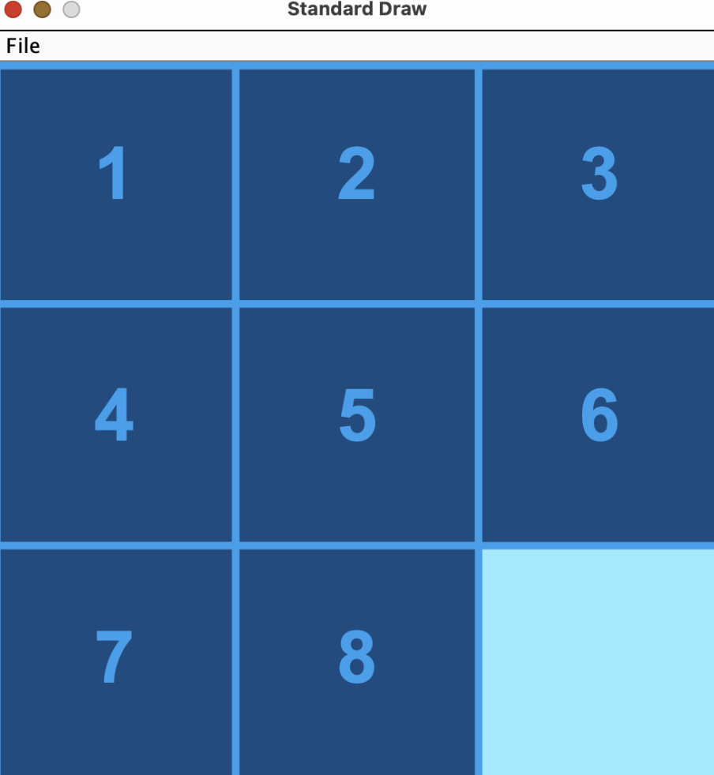
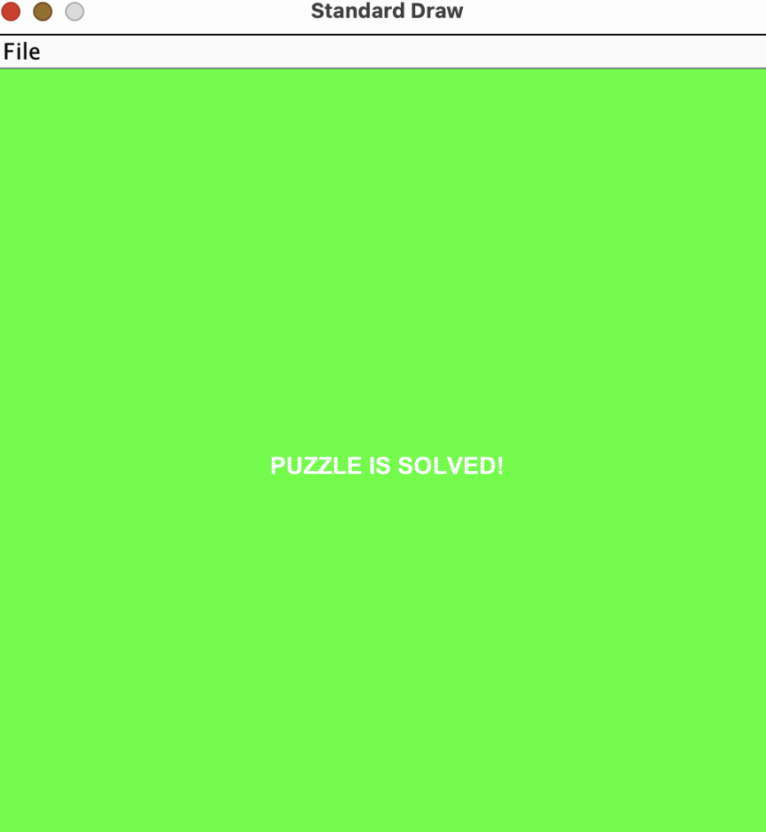
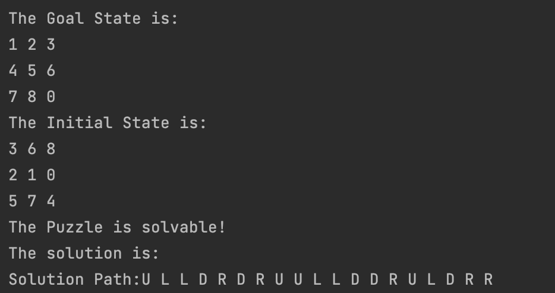
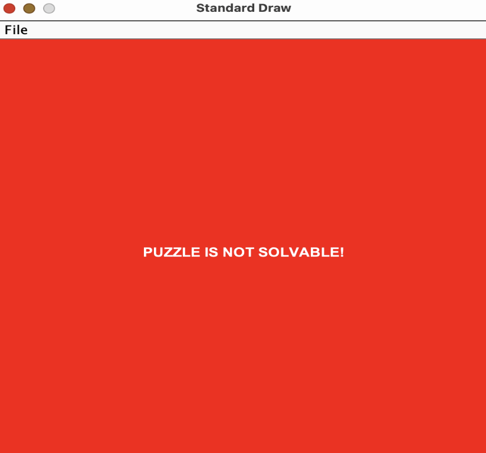

## PROJECT DESCRIPTION

In this project, I have implement the artificial intelligence algorithm A* to solve the classic 8-puzzle game. The 8-puzzle is a sliding puzzle that consists of a 3x3 grid with eight numbered tiles and one blank space. The objective is to arrange the tiles in numerical order by sliding them into the blank space.
This algorithm is an approach to problem-solving that employs a practical method not guaranteed to be perfect or optimal, but sufficient for reaching an immediate, short-term goal or approximation.

## GUI AND OUTPUT

 

